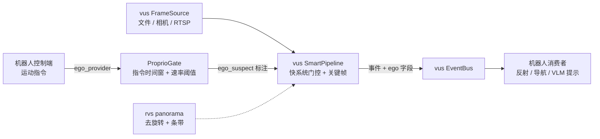

# rvs — robot-vision-skill

<div align="center">

[English](README.md) · **简体中文**


**[vus](https://github.com/CommitStrip/video-understanding-skill) 之上的机器人增量层：本体感受门控 + 外围视觉 + 机器人桥**

</div>

---

## 为什么需要 rvs

[vus](https://github.com/CommitStrip/video-understanding-skill) 已经解决了机器人的实时视频理解：快慢双系统感知（帧差门控约 1.6 ms/帧）、带费用硬上限的触发式 VLM 慎思、关键帧选择、RTSP 接入、SSE 状态服务。

它没有解决、而每个**移动**机器人都需要的是：知道**画面变化里哪部分是自己造成的**。静置相机可以把"没变化"当"没事发生"；移动机器人的每一帧都在变——事件门控、关键帧选择、VLM 触发的经济性全部失效。

rvs 只补这个缺口，不多做。它**不**重新实现感知、帧源、事件总线、VLM 客户端——这些直接消费 vus。

> 定位说明：运动门控 → 目标检测这条链在 NVR 领域已是标准件。本项目的差异化在**本体感受感知语义层**：事件流上的自我运动归因、外围视觉工具、面向机器人消费者的反射级接口。

## 与既有系统的定位对比

| 系统 | 触发模型 | 成本硬上限 | ASR 通道 | 机器人反射 |
|---|---|---|---|---|
| Frigate（NVR） | 运动门控 → 检测器 | 无（无 VLM） | ✗ | ✗ |
| unblink（Go + VLM） | **固定周期采样**（5 秒采 3 帧，见其 `.env.example` 实锤） | ✗ | ✗ | ✗ |
| 流式视频大模型 | 模型侧：VLM 增量吃所有帧 | 取决于模型 | ✗ | ✗ |
| **vus + rvs** | **事件触发**（运动门控 → 段闭合） | **地板间隔 + 单飞合并** | ✓ | ✓ |

最接近的邻居 unblink 以固定节奏采样喂 VLM——无事件门控、无成本硬上限、无 ASR 通道。本组合位（零训练门控 + 事件触发式 VLM + 成本上限工程 + ASR 对齐 + 机器人反射接口）在公开系统与文献中仍然空着。

## rvs 增加什么

### 1. 本体感受门控（`rvs.proprio`）

机器人的运动是**它自己指令产生的**——已知量，不需要从像素估计。`ProprioGate` 融合两个判据：

- **指令时间窗**——运动指令发出后 `window_s` 秒内的帧标记嫌疑（`command_window`）；
- **速率阈值**——角速度/线速度持续超阈保持嫌疑（`angular_rate` / `linear_rate`）；
- **静止指令永不嫌疑**——收到停车指令后，画面变化*必然*来自世界，不标嫌疑。

判定结果以 `ego_suspect` / `ego_reason` 字段随事件流透传——**不做 warp、不做光流**。感知管线原样不动；下游（反射层、VLM 提示组装、导航）自行决定如何降权被标记的事件。

### 2. 外围视觉工具（`rvs.panorama`）

equirectangular 全景纯函数（辅助低分辨率相机，非主相机）：

- `derotate(img, shift_px)`——yaw 补偿就是**列循环移位**（零插值、成本约等于零）：旋转的世界变成静止的世界；
- `yaw_to_shift(yaw_rad, width)`——角度 → 像素换算；
- `horizontal_band(img)`——裁掉极区高畸变行；
- `PanoramaSource`——真实硬件的接口空位（后续实现）。

### 3. 机器人桥（`rvs.pipeline`）

`RobotPipeline` 把 vus `FrameSource` → `ProprioGate` → vus `SmartPipeline` 接成一条链，向每个运动事件注入 `ego_suspect`/`ego_reason` 并发布到 vus `EventBus`。同时捕获关键帧（可选落盘，与打标解耦），接了打标器时在关键帧诞生瞬间按 vus 契约发布 `tag` 事件。

### 4. 语义反射弧——CLIP 零样本打标（`rvs.clip_labeler`）

`CLIPTagger` 给反射层装上真语义：对**可配置词表**做零样本打标（文本即配置，无需训练），并支持**负标签**（"background"）——无目标帧上负标签得最高分，一个模型同时覆盖打标与目标存在性过滤。

- 引擎：**CLIP ViT-B/32 双塔 ONNX（MIT 权重，商用无阻塞）**。MobileCLIP 快约 4.8×，但其 `apple-amlr` 权重仅限科研——保留为换引擎候选，不作默认。
- 延迟设计：标签集文本嵌入**离线预计算**缓存；热路径只跑视觉塔（经 vus `ClipOnnx` 的 `embed()`，每个关键帧一次）+ 一次矩阵向量乘。
- 打标输入支持**运动框裁剪**（与 motion_crop 流水线同一 box/scale 契约）——反射弧吃放大后的运动区域，不吃整帧。

```python
# 一次性准备（见 scripts/）：
bash scripts/download_clip_onnx.sh            # 模型（int8 约 153MB）+ BPE 词表
python scripts/gen_label_embeddings.py --labels labels.json

# 运行时（热路径只有视觉塔）：
tagger = CLIPTagger(labels=["a person walking", "a moving car"],
                    negative_labels=["background, empty scene"])
pipe = RobotPipeline(source, labeler=tagger, out_dir="out")
# 事件流新增：{"type": "tag", "labels": [...], "source": "clip", "ms": ...}
```

## 架构



## 安装

```bash
pip install git+https://github.com/CommitStrip/rvs.git
# 依赖 vus 核心库（随依赖传递安装）
```

开发模式：

```bash
git clone https://github.com/CommitStrip/video-understanding-skill.git ../video-understanding-skill
pip install -e ../video-understanding-skill
pip install -e . && python -m pytest tests/
```

## 快速开始

```python
from vus.source import FileSource
from rvs import RobotPipeline, CommandState

# 1) 控制端每个节拍喂运动指令
def ego_provider(t):
    return CommandState(t=t, linear_v=0.8)   # 例如来自轮式里程计 / cmd_vel

# 2) 在任意 vus 帧源上跑桥接
pipe = RobotPipeline(FileSource("day_route.mp4"), ego_provider=ego_provider)
summary = pipe.run()

# 3) 消费事件——vus 契约 + 自我运动归因
sub = pipe.bus.subscribe()
for ev in sub.drain():
    if ev["type"] == "motion" and ev["ego_suspect"]:
        ...  # 大概率自我运动：降权或延迟处理

# 慎思（VLM）空槽——不捆绑模型，自带后端：
# from vus.live.vlm_client import create_vlm
# vlm = create_vlm("mock")            # 确定性、零成本
# vlm = create_vlm("openai", ...)     # 端点经环境变量配置
```

## 慎思（VLM）空槽

rvs **不捆绑任何模型**。槽位就是 vus 的后端注册表：`create_vlm("mock")` 离线跑通全链（确定性输出）；`create_vlm("openai")` 对接任意 OpenAI 兼容端点。凭据**只从环境变量读取**——源码、配置、示例中一律不出现。

## 路线图

- [x] T0.5 的 CLIP 反射层：有界词表零样本打标、文本嵌入离线缓存、负标签过滤（`rvs.clip_labeler`）
- [x] 慎思集成：`RobotPipeline.attach_understanding()` 把 vus `UnderstandingWorker` 挂上桥事件流；vus 侧 `ego_gate` 钩子在自我运动嫌疑窗口内延迟触发（素材照收不丢）
- [ ] 全景源实现 + 外围事件触发的注意力转移
- [ ] 自我意图渲染：把机器人规划路径投影进画面作为 VLM 的视觉标注（原创方向）
- [ ] 平移的前馈运动补偿（指令运动学 → 单应 warp），恢复持续运动期的事件质量
- [ ] MobileCLIP 换引擎（待许可解除——`apple-amlr` 权重仅限科研）

## 许可

MIT
