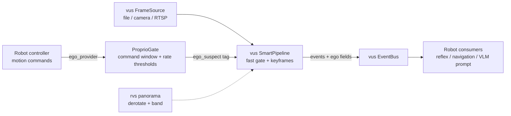

# rvs — robot-vision-skill

<div align="center">

**English** · [简体中文](README-CN.md)


**A robot-native increment layer on top of [vus](https://github.com/CommitStrip/video-understanding-skill): proprioceptive gating + peripheral vision + robot bridge**

</div>

---

## Why rvs

[vus](https://github.com/CommitStrip/video-understanding-skill) already solves real-time video understanding for robots: fast/slow dual-system perception (frame-differencing gate at ~1.6 ms/frame), trigger-based VLM deliberation with a hard cost ceiling, keyframe selection, RTSP sources, and an SSE state service.

What it does **not** have — and what every moving robot needs — is knowing **which part of the frame change is caused by itself**. A static camera can treat "no change" as "nothing happening"; a moving robot makes every frame change, which destroys event gating, keyframe selection, and VLM trigger economics.

rvs fills exactly that gap, and nothing more. It does **not** re-implement perception, sources, event buses, or VLM clients — those are consumed from vus.

> Positioning note: motion gating → detection pipelines are commodity (NVR stacks). The differentiating layer here is **proprioception-aware semantics**: self-motion attribution on the event stream, peripheral-vision tooling, and reflex-grade interfaces for robot consumers.

## Positioning vs existing systems

| System | Trigger model | Hard cost ceiling | ASR channel | Robot reflex |
|---|---|---|---|---|
| Frigate (NVR) | motion gate → detector | n/a (no VLM) | ✗ | ✗ |
| unblink (Go + VLM) | **fixed-interval sampling** (5 s / 3 frames, verified in its `.env.example`) | ✗ | ✗ | ✗ |
| Streaming video LLMs | model-side: VLM ingests every frame | model-dependent | ✗ | ✗ |
| **vus + rvs** | **event-triggered** (motion gate → segment close) | **floor interval + single-flight merge** | ✓ | ✓ |

The closest neighbor, unblink, samples frames at a fixed cadence — no event gating, no hard cost cap, no ASR channel. The combination occupied here (zero-training gating + event-triggered VLM + cost-cap engineering + ASR alignment + robot reflex interfaces) remains open in public systems and literature.

## What rvs adds

### 1. Proprioceptive gate (`rvs.proprio`)

A robot's motion is **commanded by itself** — a known quantity, not something to estimate from pixels. `ProprioGate` combines:

- **Command time window** — frames within `window_s` after a motion command are flagged (`command_window`);
- **Rate thresholds** — sustained angular/linear speed above threshold keeps frames flagged (`angular_rate` / `linear_rate`);
- **Stationary commands default to no suspicion** — after a stop command the robot stops *producing* frame change (an engineering prior, not a fact: braking inertia, body sway and gimbal recentering can still leave residual motion; strict deployments should add odometry/IMU zero-velocity checks — see roadmap: multi-source EgoStateProvider).

The verdict rides on the event stream as `ego_suspect` / `ego_reason` fields — **no warp, no optical flow**. The perception pipeline stays untouched; downstream consumers (reflection layer, VLM prompt builder, navigation) decide how to discount flagged events.

### 2. Peripheral vision toolkit (`rvs.panorama`)

Pure functions for equirectangular panoramas (auxiliary low-res camera, not the main camera):

- `derotate(img, shift_px)` — yaw compensation is a **circular column shift** (zero interpolation, ~zero cost): a rotating world becomes a still world;
- `yaw_to_shift(yaw_rad, width)` — angle → pixel mapping;
- `horizontal_band(img)` — crop away high-distortion polar rows;
- `PanoramaSource` — interface slot for real hardware (future).

### 3. Robot bridge (`rvs.pipeline`)

`RobotPipeline` wires a vus `FrameSource` → `ProprioGate` → vus `SmartPipeline`, injecting `ego_suspect`/`ego_reason` into every motion event and republishing on a vus `EventBus`. It also captures keyframes (optional on-disk save, decoupled from labeling) and, when a labeler is attached, publishes `tag` events on the vus contract at the moment each keyframe is born.

### 4. Reflex labeling — CLIP zero-shot tagger (`rvs.clip_labeler`)

`CLIPTagger` gives the reflex layer real semantics: zero-shot labeling against a **configurable vocabulary** (text is the config, no retraining), plus a **negative label** ("background") that wins on empty frames — one model covers both labeling and target-existence filtering.

- Engine: **CLIP ViT-B/32 dual-tower ONNX (MIT weights, commercial-safe)**. MobileCLIP is ~4.8× faster but its `apple-amlr` weights are research-only — kept as an engine-swap candidate, not a default.
- Latency design: label-set text embeddings are **precomputed offline** into a cache; the hot path runs only the vision tower (one `embed()` per keyframe via vus `ClipOnnx`) plus one matrix-vector product.
- Labeler input supports **motion-box crops** (same box/scale contract as the motion_crop pipeline), so the reflex arc fires on the magnified region, not the whole frame.

```python
# one-time setup (see scripts/):
bash scripts/download_clip_onnx.sh            # model (~153MB int8) + BPE vocab
python scripts/gen_label_embeddings.py --labels labels.json

# runtime (hot path: vision tower only):
tagger = CLIPTagger(labels=["a person walking", "a moving car"],
                    negative_labels=["background, empty scene"])
pipe = RobotPipeline(source, labeler=tagger, out_dir="out")
# events now include: {"type": "tag", "labels": [...], "source": "clip", "ms": ...}
```

## Architecture



## Install

```bash
pip install git+https://github.com/CommitStrip/robot-vision-skill.git
# requires the vus core library (installed transitively)
```

For development:

```bash
git clone https://github.com/CommitStrip/video-understanding-skill.git ../video-understanding-skill
pip install -e ../video-understanding-skill
pip install -e . && python -m pytest tests/
```

## Quick start

```python
from vus.source import FileSource
from rvs import RobotPipeline, CommandState

# 1) feed motion commands from your controller (every tick)
def ego_provider(t):
    return CommandState(t=t, linear_v=0.8)   # e.g. from wheel odometry / cmd_vel

# 2) run the bridge over any vus source
pipe = RobotPipeline(FileSource("day_route.mp4"), ego_provider=ego_provider)
summary = pipe.run()

# 3) consume events — vus contract + ego attribution
sub = pipe.bus.subscribe()
for ev in sub.drain():
    if ev["type"] == "motion" and ev["ego_suspect"]:
        ...  # likely self-motion: discount or defer

# VLM deliberation slot (no model bundled — bring your own backend):
# from vus.live.vlm_client import create_vlm
# vlm = create_vlm("mock")            # deterministic, zero cost
# vlm = create_vlm("openai", ...)     # endpoint via environment variables
```

## Deliberation (VLM) slot

rvs ships **no model**. The slot is vus's backend registry: `create_vlm("mock")` runs the full chain offline with deterministic output; `create_vlm("openai")` talks to any OpenAI-compatible endpoint. Credentials are read **only from environment variables** — never embed them in source, configs, or examples.

## Roadmap

- [x] CLIP reflex layer on T0.5: bounded-vocabulary zero-shot labels, offline text-embedding cache, negative-label filtering (`rvs.clip_labeler`)
- [x] Deliberation integration: `RobotPipeline.attach_understanding()` mounts vus `UnderstandingWorker` on the bridge event stream; the vus-side `ego_gate` hook defers triggers while the robot is in a self-motion suspicion window (material is kept, nothing is lost)
- [x] Peripheral vision: `EquirectFileSource` (yaw injection or constant-rate synthesis) + `PeripheralMonitor` (absolute-yaw de-rotation + band frame differencing — a static world stays exactly still) + `DualCameraRig` dual-camera orchestration. Periphery `periphery_motion` events carry the world azimuth (`col_ratio`) for attention-shift decisions.
- [x] Self-intent rendering: `IntentOverlay` renders the robot's motion command as a magenta dashed arrow in the frame (swapped in before perception via the `on_frame` hook), with its semantic anchor synced into the VLM prompt. Real path projection (world→image) left as the `render_path` slot; `bench/intent_ab.py` provides the attention A/B script (needs a live VLM endpoint).
- [ ] Feed-forward motion compensation for translation (commanded kinematics → homography warp) to restore event quality during sustained motion
- [ ] MobileCLIP engine swap (pending license clearance — `apple-amlr` weights are research-only)

## Baseline experiment (W-E, scheduler-level measurement)

Three baselines × **13.4-min 1080p real footage** (25fps / 20002 frames), measured with MockVLM at the scheduler layer (semantic-quality A/B needs a live endpoint — see `bench/intent_ab.py`). Reproduce: `python bench/baseline_experiment.py --run <video> --out results.json`.

| Baseline | VLM calls | Frames fed | First conclusion (s) | Realtime×* |
|---|---|---|---|---|
| A vus event-triggered (full frames ×2, motion_crop off) | **8** | 9 | 37.8 | 97.8× |
| B fixed-interval 5s (unblink pattern) | 161 | 161 | **0.0 (billed from frame one)** | 116.9× |
| C rvs full chain (ego gating + motion_crop) | **8** | 9 | 37.8 | 90.2× |

*Realtime× is this machine's mock figure (no network round-trip); not comparable with vus's 4.7× benchmark-machine figure.

**Findings**:
1. **vus's event triggering saves 95% of VLM calls vs fixed-interval** (161→8): the 8s floor interval caps the worst-case cost (duration/interval × unit price) and quiet segments cost nothing; fixed-interval billing starts at frame zero regardless of content. **This benefit belongs to vus's scheduling design** — rvs's ego gating added zero extra call savings on this sample (see finding 3); its correctness is covered by synthetic and end-to-end tests and is not yet quantified on real moving-robot footage.
2. **motion_crop's token-neutrality verified**: A (full frames) and C (last-slot crop swap) feed identical frame counts (9=9) — the crop swap adds no frames; its payoff is effective resolution on small targets.
3. **ego gating works but this footage is low-sensitivity**: 7 ego-suspect events under the task envelope, and no trigger points fell inside suspicion windows, so call counts stayed equal; gating correctness is covered by tests (vus ego_gate unit tests + the rvs zero-deliberation end-to-end test).
4. Synthetic three-segment footage (deterministic) corroborates: fixed-interval 12 calls vs triggered 2 (−83%), with fixed-interval still billing through still segments.

## License

MIT
