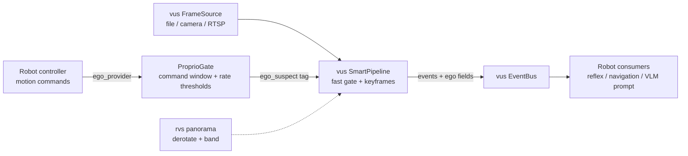

# rvs — robot-vision-skill

<div align="center">

**English** · [简体中文](README-CN.md)


**A robot-native increment layer on top of [vus](https://github.com/CommitStrip/video-understanding-skill): proprioceptive gating + peripheral vision + robot bridge**

</div>

---

## Why rvs

[vus](https://github.com/CommitStrip/video-understanding-skill) already solves real-time video understanding for robots: fast/slow dual-system perception (frame-differencing gate at ~1.6 ms/frame), trigger-based VLM deliberation with a hard cost ceiling, keyframe selection, RTSP sources, and an SSE state service.

What it does **not** have — and what every moving robot needs — is knowing **which part of the frame change is caused by itself**. A static camera can treat "no change" as "nothing happening"; a moving robot makes every frame change, which destroys event gating, keyframe selection, and VLM trigger economics.

rvs fills exactly that gap, and nothing more. It does **not** re-implement perception, sources, event buses, or VLM clients — those are consumed from vus.

> Positioning note: motion gating → detection pipelines are commodity (NVR stacks). The differentiating layer here is **proprioception-aware semantics**: self-motion attribution on the event stream, peripheral-vision tooling, and reflex-grade interfaces for robot consumers.

## Positioning vs existing systems

| System | Trigger model | Hard cost ceiling | ASR channel | Robot reflex |
|---|---|---|---|---|
| Frigate (NVR) | motion gate → detector | n/a (no VLM) | ✗ | ✗ |
| unblink (Go + VLM) | **fixed-interval sampling** (5 s / 3 frames, verified in its `.env.example`) | ✗ | ✗ | ✗ |
| Streaming video LLMs | model-side: VLM ingests every frame | model-dependent | ✗ | ✗ |
| **vus + rvs** | **event-triggered** (motion gate → segment close) | **floor interval + single-flight merge** | ✓ | ✓ |

The closest neighbor, unblink, samples frames at a fixed cadence — no event gating, no hard cost cap, no ASR channel. The combination occupied here (zero-training gating + event-triggered VLM + cost-cap engineering + ASR alignment + robot reflex interfaces) remains open in public systems and literature.

## What rvs adds

### 1. Proprioceptive gate (`rvs.proprio`)

A robot's motion is **commanded by itself** — a known quantity, not something to estimate from pixels. `ProprioGate` combines:

- **Command time window** — frames within `window_s` after a motion command are flagged (`command_window`);
- **Rate thresholds** — sustained angular/linear speed above threshold keeps frames flagged (`angular_rate` / `linear_rate`);
- **Stationary commands never flag** — after a stop command, frame change is *certainly* the world, so no suspicion.

The verdict rides on the event stream as `ego_suspect` / `ego_reason` fields — **no warp, no optical flow**. The perception pipeline stays untouched; downstream consumers (reflection layer, VLM prompt builder, navigation) decide how to discount flagged events.

### 2. Peripheral vision toolkit (`rvs.panorama`)

Pure functions for equirectangular panoramas (auxiliary low-res camera, not the main camera):

- `derotate(img, shift_px)` — yaw compensation is a **circular column shift** (zero interpolation, ~zero cost): a rotating world becomes a still world;
- `yaw_to_shift(yaw_rad, width)` — angle → pixel mapping;
- `horizontal_band(img)` — crop away high-distortion polar rows;
- `PanoramaSource` — interface slot for real hardware (future).

### 3. Robot bridge (`rvs.pipeline`)

`RobotPipeline` wires a vus `FrameSource` → `ProprioGate` → vus `SmartPipeline`, injecting `ego_suspect`/`ego_reason` into every motion event and republishing on a vus `EventBus`. The vus event contract is preserved verbatim — vus consumers keep working, robot consumers get the extra fields.

## Architecture



## Install

```bash
pip install git+https://github.com/CommitStrip/rvs.git
# requires the vus core library (installed transitively)
```

For development:

```bash
git clone https://github.com/CommitStrip/video-understanding-skill.git ../video-understanding-skill
pip install -e ../video-understanding-skill
pip install -e . && python -m pytest tests/
```

## Quick start

```python
from vus.source import FileSource
from rvs import RobotPipeline, CommandState

# 1) feed motion commands from your controller (every tick)
def ego_provider(t):
    return CommandState(t=t, linear_v=0.8)   # e.g. from wheel odometry / cmd_vel

# 2) run the bridge over any vus source
pipe = RobotPipeline(FileSource("day_route.mp4"), ego_provider=ego_provider)
summary = pipe.run()

# 3) consume events — vus contract + ego attribution
sub = pipe.bus.subscribe()
for ev in sub.drain():
    if ev["type"] == "motion" and ev["ego_suspect"]:
        ...  # likely self-motion: discount or defer

# VLM deliberation slot (no model bundled — bring your own backend):
# from vus.live.vlm_client import create_vlm
# vlm = create_vlm("mock")            # deterministic, zero cost
# vlm = create_vlm("openai", ...)     # endpoint via environment variables
```

## Deliberation (VLM) slot

rvs ships **no model**. The slot is vus's backend registry: `create_vlm("mock")` runs the full chain offline with deterministic output; `create_vlm("openai")` talks to any OpenAI-compatible endpoint. Credentials are read **only from environment variables** — never embed them in source, configs, or examples.

## Roadmap

- [ ] Deep integration with vus `UnderstandingWorker` (trigger-based deliberation needs an ego hook on the vus side)
- [ ] CLIP reflex layer on T0.5: bounded-vocabulary zero-shot labels at MobileCLIP-class latency (3–15 ms), fed by motion-box crops after de-rotation
- [ ] Panorama source implementation + periphery-triggered attention shifts
- [ ] Self-intent rendering: project the robot's planned path into the frame as a visual annotation for the VLM (original research direction — see design notes)
- [ ] Feed-forward motion compensation for translation (commanded kinematics → homography warp) to restore event quality during sustained motion

## License

MIT
